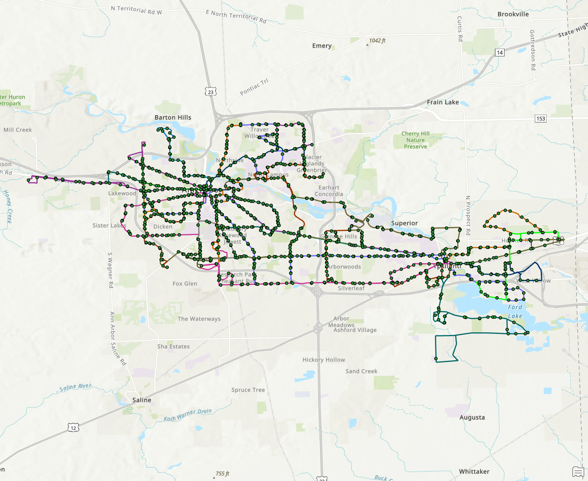

# URP 610 Assignment 1 - SSN Report

> Author: Haolin Li (haolinli@umich.edu)
>
> Last Updated: 10/31/2024
>
> GitHub Source: https://github.com/HumblePasty/urban-networks


## Data & Research Question

### Research Questions

For this assignment, I seek to construct the bus stop infrastructure network in Ann Arbor from open source data, explore the topographical and spatial attributes of the network and potentially explain the characteristics/attributes of the network in a social/environmental content.

More specifically, I seek to answer the following questions:

- What is the network structure of Ann Arbor's bus stop network? (for example, degree distribution, centrality, etc)
- Which stops are important in the network? How are they distributed?
- Which areas have relatively higher density of bus stops? Are they aligned with the busy areas of Ann Arbor?


### Data Source

- [AATA Bus Route Data (GTFS[^1])](https://www.transit.land/operators/o-dps2-annarborareatransportationauthority#stops)
- [AATA Bus Stop data](https://www.a2gov.org/services/data/Pages/default.aspx)[^2]
- [Ann Arbor Streetlights data](https://www.a2gov.org/services/data/Pages/default.aspx)[^2]


### Data Wrangling

#### GTFS data to network data (GEXF)

The first part of data processing, as mentioned [here](https://xfliang.notion.site/User-Guide-f3fc18c76faa40018d8d1f75e42b48b5), is to generate network data (that can be imported into Gephi) from the data stored in GTFS[^1] standard.

We want to make the bus stops the nodes in the network and add edge between two nodes if they are connected. We also want to keep information about the nodes (for example longitude and latitude as the spatial component). A well developed standard that can be a good format is [GEXF](https://gexf.net/index.html).

A GEXF file is in fact a xml file that follows a certain schema[^3] set up by the authors. The most important part of this process is to locate where the corresponding information should be stored in the GTFS file and append this information at the correct part of the GEXF file (by constructing xml lines).

I used python code to complete the process, taking in the GTFS folder provided by TheRide and exported `output.gexf`. The full script is in `GTFS2Network.py`. The methods applied in the code is adopted from a GitHub repo called `paulgb/gtfs-gexf`[^4], which originally is for processing New York MTA GTFS data.

```python

'''
Transform a GTFS (General Transit Feed Specification) file into an undirected
GEXF (Graph Exchange XML Format) graph.
'''

# GTFS defines these route types
LRT_TYPE = '0'
SUBWAY_TYPE = '1'
RAIL_TYPE = '2'
BUS_TYPE = '3'
FERRY_TYPE = '4'
CABLE_CAR_TYPE = '5'
GONDOLA_TYPE = '6'
FUNICULAR_TYPE = '7'

# Root of the extracted GTFS file
DATA_ROOT = './data/google_transit/'

# You can filter the type of stop converted by placing the route types
# you're interested in in this list.
CONVERT_ROUTE_TYPES = [BUS_TYPE]

# This defines an optional mapping on station names. Because stations
# are uniquely identified by their station name, this can be used to
# merge two nodes (stations) into one.
STATION_MAP = {
}

# Sometimes there are stations you may want to discard altogether
# (including their edges). They can be added to this set.
DISCARD_STATIONS = set([
])

# A function for normalizing a stop name. Can be used to eg. remove
# a platform name or direction.
def get_stop_name(stop_name):
    name = stop_name
    #name = stop_name.split(' - ')[0]
    return STATION_MAP.get(name, name)
 
def get_stop_id(stop_id):
    return stop_id[:-1]

from csv import DictReader
from itertools import groupby
from xml.dom.minidom import Document

class GEXF(object):
    def __init__(self):
        self.doc = Document()
        gexf = self.doc.createElement('gexf')
        gexf.setAttribute('xmlns', 'http://gexf.net/1.3')
        gexf.setAttribute('version', '1.3')
        gexf.setAttribute('xmlns:xsi', 'http://www.w3.org/2001/XMLSchema-instance')
        gexf.setAttribute('xsi:schemaLocation', 'http://gexf.net/1.3 http://gexf.net/1.3/gexf.xsd')
        gexf.setAttribute('xmlns:viz', 'http://www.gexf.net/1.3/viz')

        graph = self.doc.createElement('graph')
        graph.setAttribute('defaultedgetype', 'directed')

        node_attributes = graph.appendChild(self.doc.createElement('attributes'))
        node_attributes.setAttribute('class', 'node')

        attribute1 = node_attributes.appendChild(self.doc.createElement('attribute'))
        attribute1.setAttribute('id', '0')
        attribute1.setAttribute('title', 'Longitude')
        attribute1.setAttribute('type', 'float')

        attribute2 = node_attributes.appendChild(self.doc.createElement('attribute'))
        attribute2.setAttribute('id', '1')
        attribute2.setAttribute('title', 'Latitude')
        attribute2.setAttribute('type', 'float')

        self.nodes = graph.appendChild(self.doc.createElement('nodes'))
        self.edges = graph.appendChild(self.doc.createElement('edges'))

        gexf.appendChild(graph)
        self.doc.appendChild(gexf)

    def add_node(self, node_id, label, x, y):
        node = self.doc.createElement('node')
        node.setAttribute('id', node_id)
        node.setAttribute('label', label)

        attrivalues = node.appendChild(self.doc.createElement('attvalues'))

        attrivalue1 = attrivalues.appendChild(self.doc.createElement('attvalue'))
        attrivalue1.setAttribute('for', '0')
        attrivalue1.setAttribute('value', x)

        attrivalue2 = attrivalues.appendChild(self.doc.createElement('attvalue'))
        attrivalue2.setAttribute('for', '1')
        attrivalue2.setAttribute('value', y)

        viz_position = node.appendChild(self.doc.createElement('viz:position'))
        viz_position.setAttribute('x', str(x))
        viz_position.setAttribute('y', str(y))

        self.nodes.appendChild(node)

    def add_edge(self, source, target, color):
        edge = self.doc.createElement('edge')
        edge.setAttribute('source', source)
        edge.setAttribute('target', target)

        if color == '':
            r, g, b = (0, 0, 0)
        else:
            r = int(color[:2], 16)
            g = int(color[2:4], 16)
            b = int(color[4:], 16)
        viz_color = self.doc.createElement('viz:color')
        viz_color.setAttribute('r', str(r))
        viz_color.setAttribute('g', str(g))
        viz_color.setAttribute('b', str(b))

        edge.appendChild(viz_color)
        self.edges.appendChild(edge)

    def write(self, fh):
        self.doc.writexml(fh, indent='\n', addindent='  ')

def main():
    trips_csv = DictReader(open(DATA_ROOT+'trips.txt'))
    stops_csv = DictReader(open(DATA_ROOT+'stops.txt'))
    stop_times_csv = DictReader(open(DATA_ROOT+'stop_times.txt'))
    routes_csv = DictReader(open(DATA_ROOT+'routes.txt'))

    gexf = GEXF()

    routes = dict()
    for route in routes_csv:
        if route['route_type'] in CONVERT_ROUTE_TYPES:
            routes[route['route_id']] = route
    print('routes', len(routes))

    trips = dict()
    for trip in trips_csv:
        if trip['route_id'] in routes:
            trip['color'] = routes[trip['route_id']]['route_color']
            trips[trip['trip_id']] = trip
    print('trips', len(trips))

    stops = set()
    edges = dict()
    for trip_id, stop_time_iter in groupby(stop_times_csv, lambda stop_time: stop_time['trip_id']):
        if trip_id in trips:
            trip = trips[trip_id]
            prev_stop = next(stop_time_iter)['stop_id']
            stops.add(prev_stop)
            for stop_time in stop_time_iter:
                stop = stop_time['stop_id']
                edge = (prev_stop, stop)
                edges[edge] = trip['color']
                stops.add(stop)
                prev_stop = stop
    print('stops', len(stops))
    print('edges', len(edges))

    #stop_map = dict()
    # stops_used = set(DISCARD_STATIONS)
    stop_used = dict()
    # this dict is a reference for eliminating duplicate stops
    for stop in stops_csv:
        if stop['stop_id'] in stops:
            stop_id = stop['stop_id']
            #name = get_stop_name(stop['stop_name'])
            #stop_map[stop['stop_id']] = name
            name = stop['stop_name']
            # add node if name not in stops_used:
            if name not in stop_used:
                stop_used[name] = stop_id
                stop_used[stop_id] = stop_id
                gexf.add_node(stop_id, name, stop['stop_lon'], stop['stop_lat'])
            else:
                # else, map the id to the existing id
                stop_used[stop_id] = stop_used[name]
    #print 'stop_map', len(stop_map)

    edges_used = set()
    for (start_stop_id, end_stop_id), color in edges.items():
        # get the name of the start and end stop
        start_stop_id = stop_used[start_stop_id]
        end_stop_id = stop_used[end_stop_id]
        edge = min((start_stop_id, end_stop_id), (end_stop_id, start_stop_id))
        if edge not in edges_used:
            gexf.add_edge(start_stop_id, end_stop_id, color)
            edges_used.add(edge)

    gexf.write(open('./outputs/ann_arbor_bus_stop_netwoork.gexf', 'w'))

if __name__ == '__main__':
    main()
```


#### GTFS to GIS data (shapefile)

The bus stops and bus routes GIS data is also acquired from GTFS data. Here I used ArcGIS to do the processing:

- For bus stop point feature data, instead of using the layer from AATA, I applied the `GTFS Stops To Features (Public Transit)`[^5] tool in ArcGIS to get the bus stops layer
- For bus routes data, I used the `GTFS Shapes To Features (Public Transit)`[^6] to convert the `shapes.txt` file in GTFS data (which) stores the route locations into shapefile




## Network Analytics

The output GEXF file was imported to Gephi for visualization and analysis (the sample preview graph below was `expanded` for better view)

[Link to Published Network Data](https://ouestware.gitlab.io/retina/beta/#/graph/?url=https://gist.githubusercontent.com/HumblePasty/9b1ebc1d0da30187f8a71da0b14a55d0/raw/3fe09f32a9eff8359601428f44d0feceb87663a7/network-735d41d9-28f.gexf)


Notes on the network data:

- The original number of stops specified in `stops.txt` in the GTFS data is 1118. This number is greater than the number of nodes because I deliberately removed the bus stops that share the same name (because they are in the same intersection). 
- This method can be biased because some bus stops can also be considered as the same stop (because they are really close to each other) but only named differently because they are on different sides of the road, or due to different abbreviations (for example N. University + Carpenter and North University + Carpenter)
- The node locations shown in the network visualization represents the real locations of the bus stops. This is achieved by specifying the `viz:position` property in the GEXF file.
- The color of the edges are drawn from the color specified in `routes.txt` in the GTFS data. This is achieved by specifying the `viz:color` property in the GEXF file.
- Labelled based on the name of the bus stop


### Network statistics

|   Network Statistics   |  Value   |                       Interpretations                        |
| :--------------------: | :------: | :----------------------------------------------------------: |
|    number of nodes     |   921    |                              -                               |
|    number of edges     |   1159   |                              -                               |
|     average degree     |  1.258   | The average degree in this directed graph is 1.258, which means that most of the stops are only connected to its previous (or next) stop, which makes sense for a bus network. |
|    network diameter    |    97    | This indicates that if a person wants to experience the longest bus ride in Ann Arbor without visiting the same bus stops twice, they can visit at most 97 stops. |
|     graph density      |  0.001   | This means that the network is very loose-connected. This makes sense for a bus network because most of the stops are only connected to its previous (or next) stop. |
|  connected components  |    1     |  All the bus stops are connected, which should be the case.  |
| modularity/communities | 0.883/25 | 25 communities were detected, which is close to the number of routes (32). This suggests that bus stops are highly organized into distinct clusters, meaning certain groups of stops are much more connected to each other than to stops in other clusters, likely reflecting well-defined routes or areas with concentrated transit services. The differences also indicates that some stops from different routes were considered to be in one community, this might be the case when a bus route is a extension of another or they overlaps with each other. |
|  average path length   |  34.508  | An average path length of 34.508 in a bus stop network means that, on average, it takes about 34.5 stops to travel between any two bus stops in the network, indicating a relatively large or spread-out transit system where stops are interconnected across extended routes. |


### What is the relationship between the degree of bus stops and their distance to city center?


- The bus stop data does not contain the distance to city center originally. This field is calculated using coordinate from this website[^7] and ArcGIS calculation field
- According to the chart, there is no significant trend with low degree bus stops , but high-degree nodes are tend to be closer to city center

```python
from matplotlib import pyplot as plt
import pandas as pd

# Load the CSV files
network_attr_nodes = pd.read_csv('./temp/network_attr_nodes.csv')
spatial_properties = pd.read_csv('./temp/stops_arcgis_outputtable.csv')

# Merge the dataframes on the 'Id' column
# network_attr_nodes.Id = spatial_properties.stop_id
merged_df = pd.merge(network_attr_nodes, spatial_properties, left_on='Id', right_on='stop_id')

# create a scatter plot with degree on the x-axis, and distance to city center on the y-axis
plt.scatter(merged_df['Degree'], merged_df['dist_ctr'], c=merged_df['Degree'], cmap='viridis_r', alpha=0.8)
# title
plt.title('Degree vs Distance to City Center')
# x-axis label
plt.xlabel('Degree')
# y-axis label
plt.ylabel('Distance to City Center (m)')
# label the points with degree > 7
for i, stop_name in enumerate(merged_df['stop_name']):
    if merged_df['Degree'][i] > 7:
        # offset the text so that the center of the text is at the point
        plt.text(merged_df['Degree'][i], merged_df['dist_ctr'][i], stop_name, fontsize=6, ha='center', va='center')

# Save the plot to a file
plt.savefig('./temp/degree_vs_distance.png')
```


### Hotspot analysis of bus stops

[ArcGIS Web Map](https://umich.maps.arcgis.com/home/item.html?id=5732f8f1fc3e4952a8de29a0fb1d5bae)

In this part, I seek to answer the question "Which areas have relatively higher density of bus stops? Are they aligned with the busy areas of Ann Arbor?"

To answer this question, I applied the `Find Hot Spots` tool in ArcGIS to the bus stop shapefile layer with neighborhood size of 500 meter and bin size of 400 meter. The exported result is as follow (darker meaning more bus stops, points are bus stops and lines are bus routes):


To compare the detected hot spot areas with busy areas, I used the street lights point layer provided by Ann Arbor GIS service as a indicator (this is based on a assumption that busy areas usually have more street lights). I applied the same tool to detect the hotspots but with smaller neighborhood size and bin size (this is because street light data is more abundant and using smaller size can generate more accurate result) and the output is as follows (darker meaning higher density, points are street lights):


By comparing the two hotspot detection results, we can see that:

- In general, the hotspots in bus stops aligns well with the busy areas indicated by street light data. This correlation is most significant in downtown Ann Arbor around Blake Transit Center.
- In north campus of U-M, this correlation seems to be less significant. While there are tons of street lights in this area, there are not so many bus stops. This might be due to the fact that most bus stops in north campus are operated by Blue Bus and thus are not integrated in the bus stop system by TheRide.
- The bus stop hot spots are more distributed, but they tend to appear around the main streets


## Visualizations

### Which bus stops are important?


- The above visualization of network shows the importance of the bus stops in node size, label size and text color
- This graph is generated with Gephi
- The edge color is the assigned color by the GTFS data
- The bus stops with degrees of 5 or greater is highlighted
- 5 is chosen because this is the minimum amount of edge required for a stop to be a intersection stop (if a stop has a degree of 4, that can be a normal stop along the line because the total number of in degree and out degree can be 4)


### Deployed interactive web apps

For interactive sharing and exploring, I published the GEXF and GIS project to web applications. Below are the links to the projects:

- [Link to Published Network Data](https://ouestware.gitlab.io/retina/beta/#/graph/?url=https://gist.githubusercontent.com/HumblePasty/9b1ebc1d0da30187f8a71da0b14a55d0/raw/3fe09f32a9eff8359601428f44d0feceb87663a7/network-735d41d9-28f.gexf)
- [ArcGIS Web Map](https://umich.maps.arcgis.com/home/item.html?id=5732f8f1fc3e4952a8de29a0fb1d5bae)


### Notes on ideas for further analysis

I didn't have the chance to do the following, but they seems interesting and practical:

- do the serving density (indicated by the trip schedules) match with the population density?
- What is the percentage of population/households that cannot find a bus stop in Ann Arbor in 15min?


## References

[^1]:  “Reference - General Transit Feed Specification.” Accessed: Oct. 30, 2024. [Online]. Available: https://gtfs.org/documentation/schedule/reference/
[^2]:  “Data Catalog.” Accessed: Oct. 30, 2024. [Online]. Available: https://www.a2gov.org/services/data/Pages/default.aspx
[^3]: “GEXF File Format.” Accessed: Oct. 31, 2024. [Online]. Available: https://gexf.net/schema.html
[^4]: P. Butler, *paulgb/gtfs-gexf*. (May 08, 2018). Python. Accessed: Oct. 31, 2024. [Online]. Available: https://github.com/paulgb/gtfs-gexf
[^5]: “GTFS Stops To Features (Public Transit)—ArcGIS Pro | Documentation.” Accessed: Oct. 31, 2024. [Online]. Available: https://pro.arcgis.com/en/pro-app/latest/tool-reference/public-transit/gtfs-stops-to-features.htm
[^6]: “GTFS Shapes To Features (Public Transit)—ArcGIS Pro | Documentation.” Accessed: Oct. 31, 2024. [Online]. Available: https://pro.arcgis.com/en/pro-app/3.1/tool-reference/public-transit/gtfs-shapes-to-features.htm
[^7]: “Where is Ann Arbor, MI, USA on Map Lat Long Coordinates.” Accessed: Nov. 01, 2024. [Online]. Available: https://www.latlong.net/place/ann-arbor-mi-usa-610.html
