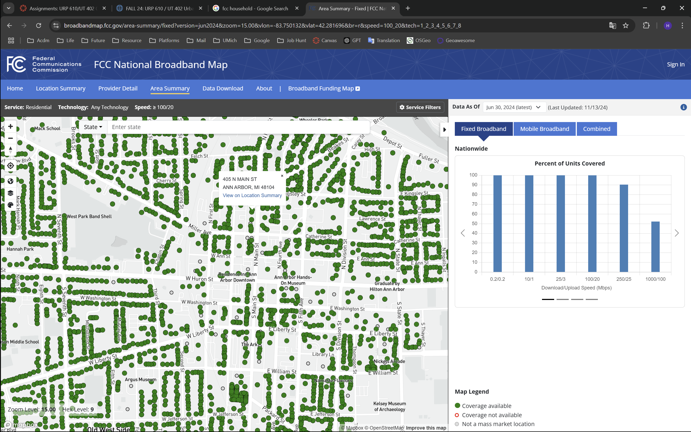

# URP 610 Final Project Proposal

> Author: Haolin Li (haolinli@umich.edu)
>
> Last Updated: 11/21/2024
>
> GitHub Source: https://github.com/HumblePasty/urban-networks

## Data & Research Question

For the final project, I seek to build the scope based on the SSN assignment to do more exploration and analysis on Ann Arbor's bus stop and bus route system.

### Research Questions

For the SSN assignment, I answered the following questions:

- What is the network structure of Ann Arbor's bus stop network? (for example, degree distribution, centrality, etc)
- Which stops are important in the network? How are they distributed?
- Which areas have relatively higher density of bus stops? Are they aligned with the busy areas of Ann Arbor?

### Further Analysis and Methods

For the final project, I hope to extent the scope and try to answer the following answers:

- **Do the serving density (indicated by the trip schedules) match with the population density?**

- **What is the percentage of population/households that cannot find a bus stop in Ann Arbor in 15min?**

- Apply more **SSN analysis metrics** to analyze the spatial social network, for example:

  - Conduct **Edge/ND scan** to the network and find the network hotspot of the bus network

    Note: do I have existing lib to rely on?

  - Calculate the **global flattening ratio** of the bus network and comment on the spatial efficiency of the network

    Note: Also, potential issue in coding - are there existing lib?

### Potential Data Sources

- Population density data (ideally raster data with enough spatial resolution)

  For example GPWv411: Population Density (Gridded Population of the World Version 4.11)

  

- US household data

  This can be a point or polygon shapefile indicating the location of the households. For example FCC broadband household data:

  