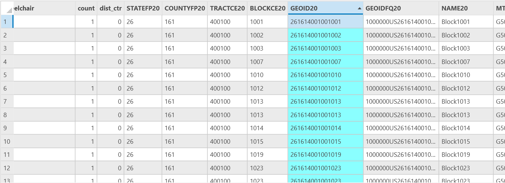
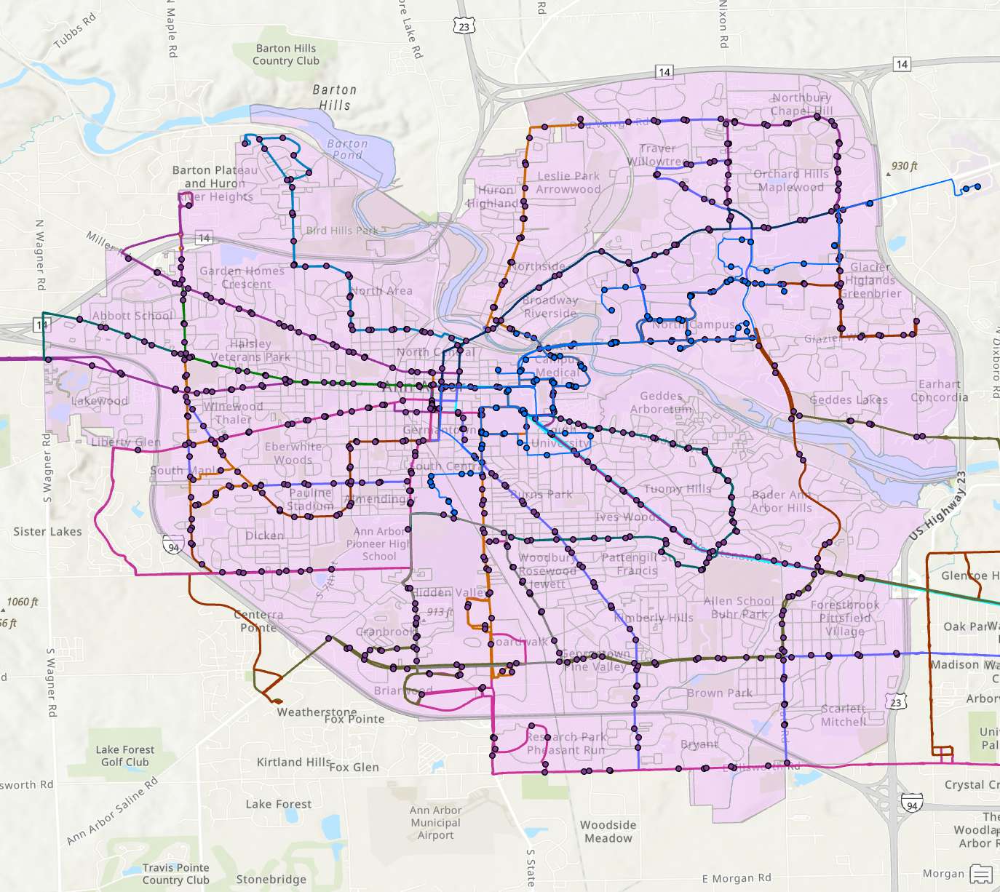
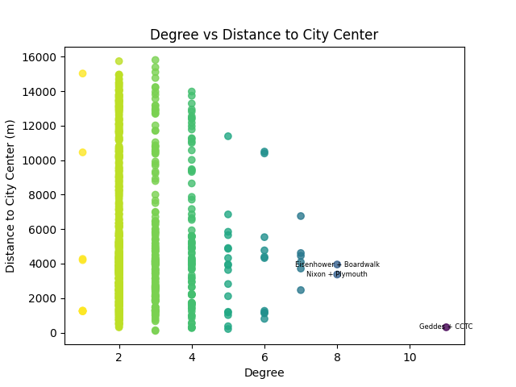
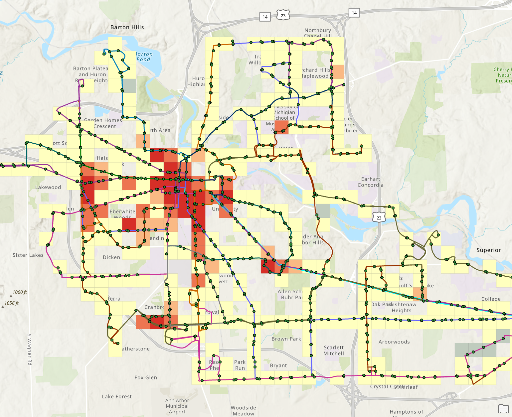
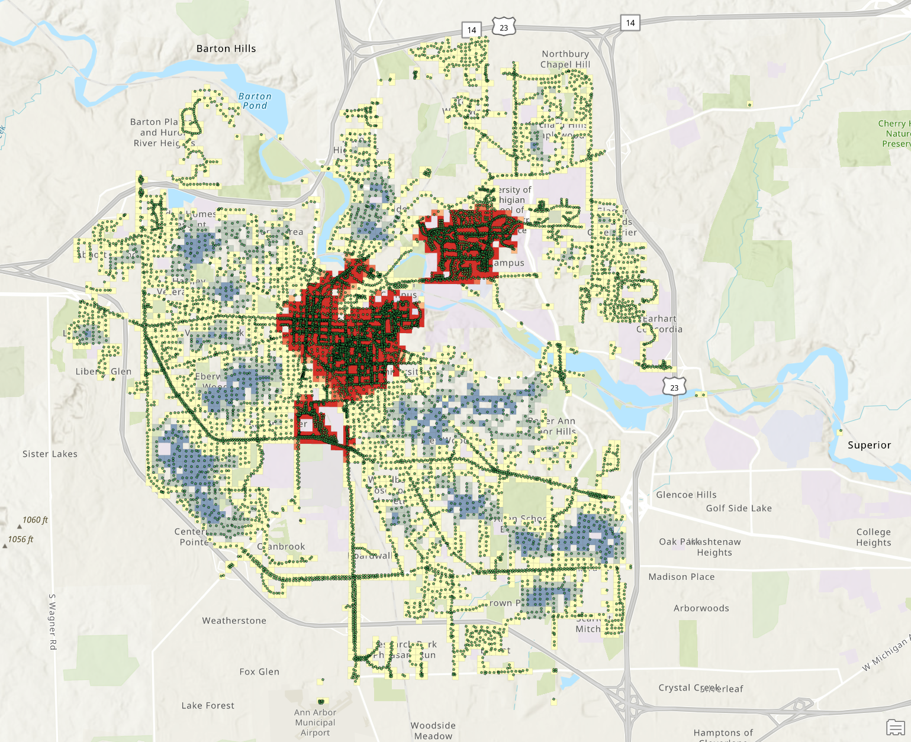
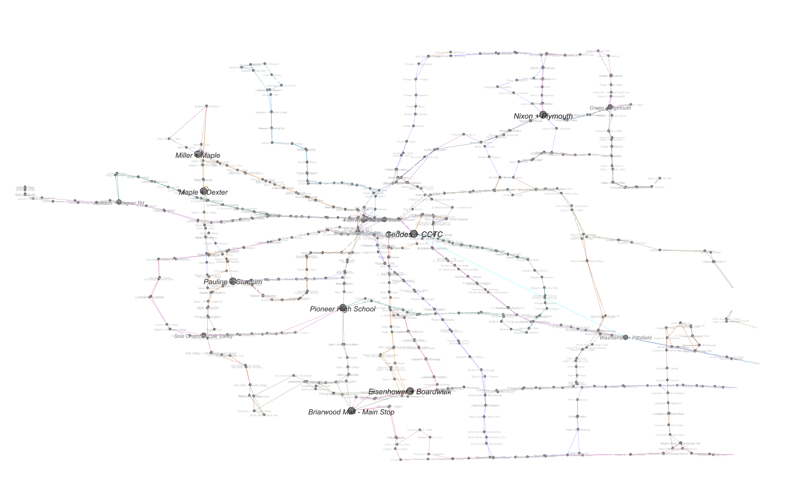
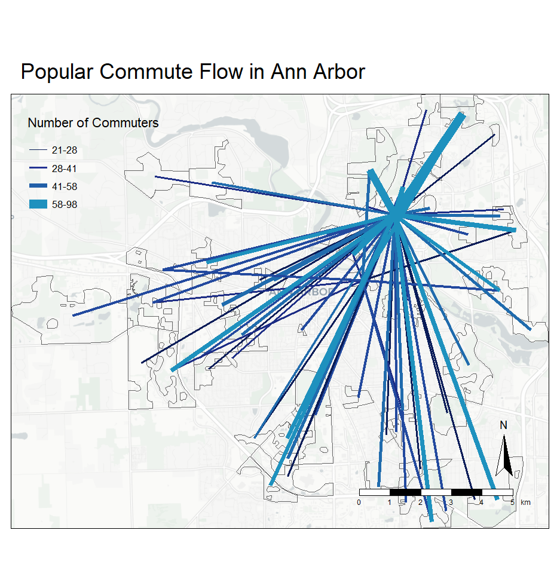
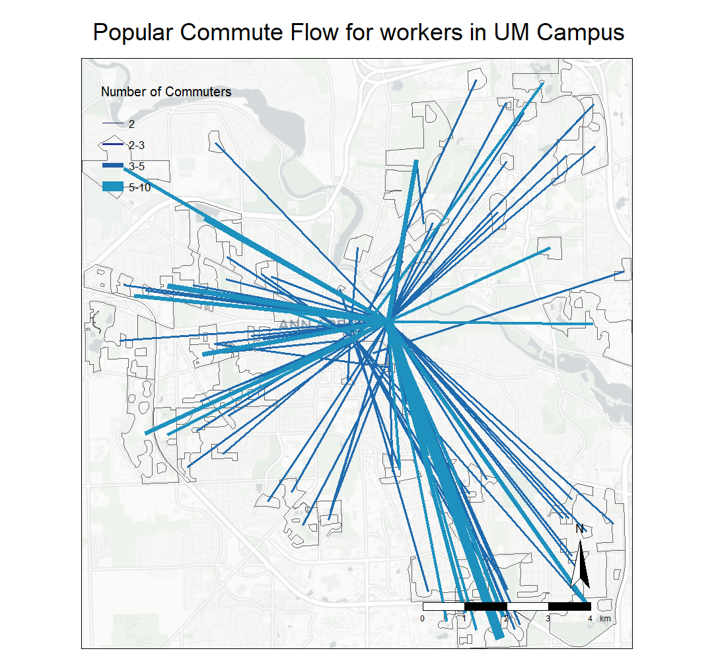

# URP 610 Final Project Report

> Author: Haolin Li (haolinli@umich.edu)
>
> Last Updated: 12/10/2024
>
> GitHub Source: https://github.com/HumblePasty/urban-networks

*Note: For the final project, I seek to build the scope based on the SSN assignment to do more exploration and analysis on Ann Arbor's bus stop and bus route system. Parts of the content in the report is based on the report for the SSN assignment.*


## Data & Research Question

The goal of the final project can be split into two parts. 

For the first part, I seek to construct the bus stop infrastructure network in Ann Arbor from open source data to explore the topographical and spatial attributes to study the intrinsic characteristics of the bus stops network.

For the second part, I seek to explore and understand how local commuters use or may use the bus system. With TheRide's new route 104 Washtenaw Express, how may affect the local commuters?

More specifically, my research questions can be stated as follow:

### Research Questions

For the first part:

- (Analysis) What is the network structure of Ann Arbor's bus stop network? (for example, degree distribution, centrality, etc)
- (Visualization) Which stops are important in the network? How are they distributed?
- (Analysis) Which areas have relatively higher density of bus stops? Are they aligned with the busy areas of Ann Arbor?

For the second part:

- (Visualization) According to LODES data, which census blocks are the most connected?
- (Analysis) How will the commuters use the bus system? How efficient the bus network is to them? Or more specifically:
  - What percentage of commuters have direct bus routes between their workplace and their residence?
  - How does that change w/wo the new route (104)?
- (Visualization) For the commuters who works at UM Campus, where do they live?


### Data Source

- [AATA Bus Route Data (GTFS[^1])](https://www.transit.land/operators/o-dps2-annarborareatransportationauthority#stops)
- [AATA Bus Stop data](https://www.a2gov.org/services/data/Pages/default.aspx)[^2]
- [Ann Arbor Streetlights data](https://www.a2gov.org/services/data/Pages/default.aspx)[^2]
- [Ann Arbor Boundary data](https://www.a2gov.org/services/data/Pages/default.aspx)
- [Tiger/Line data product (Census Blocks)](Tiger/Line data product (Census Blocks))
- [LEHD Origin-Destination Employment Statistics (LODES) Dataset](https://lehd.ces.census.gov/data/)


### Compiling the Dataset

#### 1. GTFS Data to Network Data (GEXF)

The first part of data processing involved generating network data (importable into Gephi) from GTFS[^1] standard data. Bus stops were designated as nodes in the network, with edges added between nodes if they were connected. Node attributes, such as longitude and latitude, were preserved as spatial components. The output format used was [GEXF](https://gexf.net/index.html), an XML-based schema designed for network representation. The script `GTFS2Network.py` was developed to process GTFS data provided by TheRide and export it as `output.gexf`. The methods implemented in the script were adapted from the GitHub repository `paulgb/gtfs-gexf`[^4], originally designed for New York MTA GTFS data.

#### 2. GTFS to GIS Data (shapefile)

The bus stops and bus routes GIS data is also acquired from GTFS data. Here I used ArcGIS to do the processing:

- For bus stop point feature data, instead of using the layer from AATA, I applied the `GTFS Stops To Features (Public Transit)`[^5] tool in ArcGIS to get the bus stops layer
- For bus routes data, I used the `GTFS Shapes To Features (Public Transit)`[^6] to convert the `shapes.txt` file in GTFS data (which) stores the route locations into shapefile

#### 3. Census Blocks in Ann Arbor

The Census Block shapefile was originally downloaded from the TIGER/Line data portal. The blocks were then clipped with Ann Arbor Boundary to keep only the blocks in Ann Arbor. The polygon of Ann Arbor actually contained holes and they were filled before intersection.

#### 4. Downloading and Filtering LODES

The LODES data is acquired using script adopted from class. The state is restricted to Michigan in year 2021, and the data is aggregated in Census Blocks (which is the smallest census shape) to keep the most detailed information.

The retrieved data was then filtered using exported table from the Census Blocks shapefile to keep only the related OD records within the Ann Arbor Area.

```R
library(tidyverse)
library(tmap)
library(stplanr)
library(sf)
library(tmap)
library(basemaps)
library(lehdr) # package to download and process lehd data
library(tigris) # package to download any census geography shapefiles; we will need it for mapping 

# set the wd as the folder where the script is located
setwd(dirname(rstudioapi::getActiveDocumentContext()$path))
getwd()

# read the census blocks from csv
aa_blocks = read.csv("../outputs/aa_blocks.csv")
# get a list of the block codes
block_codes = aa_blocks$GEOID20

# get the lobes data
aa_lodes = grab_lodes(state = "mi", year = 2021, lodes_type = "od", state_part = "main", agg_geo = "block")

# filter the lodes data to only include the block codes we are interested in
aa_lodes_1 = aa_lodes %>% filter(w_geocode %in% block_codes & h_geocode %in% block_codes)

# save as aa_lodes_cleaned.csv
write.csv(aa_lodes_1, "../outputs/aa_lodes_cleaned.csv", row.names = FALSE)
```

#### 5. Crawling M-Bus Data and Compiling the Complete Bus Dataset

TheRide is not the only bus service provider in Ann Arbor. For the students in campus, taking the M-Bus is sometimes more common than taking TheRide. And given that the blue bus is free to ride and the service intensity is high, it is important to take M-Bus into consideration.

U of M does not provide open access to the GIS/network data of its bus system. So in order to get the data necessary, I applied some data crawling methods (mainly parsing their API requests) on its [bus tracking website](https://mbus.ltp.umich.edu/map) to get the points and lines and saved into json files and used Python to convert into shapefiles for further processing.

Here is the script I used:

```python
# this file seeks to stop the route assignment process
# create a new file called stop_route_assign.py

# read stops from the stops.txt file
import pandas as pd
aa_stops = pd.read_csv('./data/google_transit/stops.txt')

# read stop_times from the stop_times.txt file
aa_stop_times = pd.read_csv('./data/google_transit/stop_times.txt')

# read trips from the trips.txt file
aa_trips = pd.read_csv('./data/google_transit/trips.txt')

# a dictionary to store each route and the stops it serves
route_stops = {}

# for every trip_id in the trips.txt file
for trip in aa_trips['trip_id']:
    # get all the stop times for that trip
    trip_stops = aa_stop_times[aa_stop_times['trip_id'] == trip]
    route_id = int(aa_trips[aa_trips['trip_id'] == trip]['route_id'].values[0])  # Convert to str
    # for every stop in the trip_stops
    for stop in trip_stops['stop_id'].values:
        stop = int(stop)  # Convert stop to int
        # if the route_id is not in the route_stops dictionary
        if route_id not in route_stops:
            # create a new key with the route_id and an empty list as the value
            route_stops[route_id] = []
        # if the stop is not in the list of stops for that route
        if stop not in route_stops[route_id]:
            # add the stop to the list of stops for that route
            route_stops[route_id].append(stop)

# export the route_stops dictionary to a json file
import json
with open('./outputs/route_stops.json', 'w') as f:
    json.dump(route_stops, f)

# next we will need to also include the M-Bus stops in the route_stops dictionary
# the bus stops are the json files in ./data/MBus
# every json file in the MBus folder is a route
# for every json file in the MBus folder

# create a shapefile with all the stops in the MBus data
import os
import geopandas as gpd
from shapely.geometry import Point
# create an empty GeoDataFrame
stops = gpd.GeoDataFrame()
# for every file in the MBus folder
for file in os.listdir('./data/MBus'):
    # open the file
    with open(f'./data/MBus/{file}', 'r') as f:
        # read the json file
        data = json.load(f)
        # the file name is the route_id
        route_id = file.split('.')[0]
        # the points are stored in bustime-response->ptr->pt
        # for every point:
        # data structure: seq, lat, lon, typ (S for stop, W for other), pdist, (if stop) stpid, stpnm
        for point in data['bustime-response']['ptr'][0]['pt']:
            # if the point is a stop
            if point['typ'] == 'S':
                # create a new GeoDataFrame with the stop
                stop = gpd.GeoDataFrame({
                    'stop_id': [point['stpid']],
                    'stop_name': [point['stpnm']],
                    'stop_lat': [point['lat']],
                    'stop_lon': [point['lon']],
                    'route_id': [route_id],
                    'geometry': [Point(point['lon'], point['lat'])]
                    })
                # append the stop to the stops GeoDataFrame
                stops = gpd.GeoDataFrame(pd.concat([stops, stop], ignore_index=True))

# save the stops GeoDataFrame to a shapefile
stops.to_file('./outputs/MBus_stops.shp')

# also create a line shapefile with the routes
from shapely.geometry import LineString
# create an empty GeoDataFrame
routes = gpd.GeoDataFrame()
# for every file in the MBus folder
for file in os.listdir('./data/MBus'):
    # open the file
    with open(f'./data/MBus/{file}', 'r') as f:
        # read the json file
        data = json.load(f)
        # the file name is the route_id
        route_id = file.split('.')[0]
        # the points are stored in bustime-response->ptr->pt
        # for every point:
        # data structure: seq, lat, lon, typ (S for stop, W for other), pdist, (if stop) stpid, stpnm
        # create a list of points for the route
        points = []
        for point in data['bustime-response']['ptr'][0]['pt']:
            # add the point to the list of points
            points.append(Point(point['lon'], point['lat']))
        # create a new GeoDataFrame with the route
        route = gpd.GeoDataFrame({
            'route_id': [route_id],
            'geometry': [LineString(points)]
            })
        # append the route to the routes GeoDataFrame
        routes = gpd.GeoDataFrame(pd.concat([routes, route], ignore_index=True))

# save the routes GeoDataFrame to a shapefile
routes.to_file('./outputs/MBus_routes.shp')


# update the route_stops dictionary with the M-Bus stops
# read the route_stops dictionary from the json file
with open('./outputs/route_stops.json', 'r') as f:
    route_stops = json.load(f)
for file in os.listdir('./data/MBus'):
    # open the file
    with open(f'./data/MBus/{file}', 'r') as f:
        # read the json file
        data = json.load(f)
        # the file name is the route_id
        route_id = file.split('.')[0]
        # the points are stored in bustime-response->ptr->pt
        # for every point:
        # data structure: seq, lat, lon, typ (S for stop, W for other), pdist, (if stop) stpid, stpnm
        for point in data['bustime-response']['ptr'][0]['pt']:
            # if the route_id is not in the route_stops dictionary
            if route_id not in route_stops:
                # create a new key with the route_id and an empty list as the value
                route_stops[route_id] = []
            # if the stop is not in the list of stops for that route
            # and if the point is a stop
            if  point['typ'] == 'S' and point['stpid'] not in route_stops[route_id]:
                # add the stop to the list of stops for that route
                route_stops[route_id].append(point['stpid'])

# export the updated route_stops dictionary to a json file
with open('./outputs/route_stops.json', 'w') as f:
    json.dump(route_stops, f)
```

#### 6. Spatial Join with Census Blocks

To connect the bus stops data with LODES data, we also need to figure out which **Census Block** each bus stop is located in. Thus spatial join is applied to add additional columns (especially the 15-digit Census Block code) to the bus stop attribute table.



#### 7. Overview

After the above procedure, here is a overview of the complete bus stops network in Ann Arbor:

- The light blue stops and lines are M-Bus network
- Others points and lines are TheRide network
- The pink layer with green lines is the Census Blocks in Ann Arbor




## Network Analytics

The output GEXF file was imported to Gephi for visualization and analysis (the sample preview graph below was `expanded` for better view)

[Link to Published Network Data](https://ouestware.gitlab.io/retina/beta/#/graph/?url=https://gist.githubusercontent.com/HumblePasty/9b1ebc1d0da30187f8a71da0b14a55d0/raw/3fe09f32a9eff8359601428f44d0feceb87663a7/network-735d41d9-28f.gexf)

Notes on the network data:

- The original number of stops specified in `stops.txt` in the GTFS data is 1118. This number is greater than the number of nodes because I deliberately removed the bus stops that share the same name (because they are in the same intersection). 
- This method can be biased because some bus stops can also be considered as the same stop (because they are really close to each other) but only named differently because they are on different sides of the road, or due to different abbreviations (for example N. University + Carpenter and North University + Carpenter)
- The node locations shown in the network visualization represents the real locations of the bus stops. This is achieved by specifying the `viz:position` property in the GEXF file.
- The color of the edges are drawn from the color specified in `routes.txt` in the GTFS data. This is achieved by specifying the `viz:color` property in the GEXF file.
- Labelled based on the name of the bus stop


### Network Statistics

|   Network Statistics   |  Value   |                       Interpretations                        |
| :--------------------: | :------: | :----------------------------------------------------------: |
|    number of nodes     |   921    |                              -                               |
|    number of edges     |   1159   |                              -                               |
|     average degree     |  1.258   | The average degree in this directed graph is 1.258, which means that most of the stops are only connected to its previous (or next) stop, which makes sense for a bus network. |
|    network diameter    |    97    | This indicates that if a person wants to experience the longest bus ride in Ann Arbor without visiting the same bus stops twice, they can visit at most 97 stops. |
|     graph density      |  0.001   | This means that the network is very loose-connected. This makes sense for a bus network because most of the stops are only connected to its previous (or next) stop. |
|  connected components  |    1     |  All the bus stops are connected, which should be the case.  |
| modularity/communities | 0.883/25 | 25 communities were detected, which is close to the number of routes (32). This suggests that bus stops are highly organized into distinct clusters, meaning certain groups of stops are much more connected to each other than to stops in other clusters, likely reflecting well-defined routes or areas with concentrated transit services. The differences also indicates that some stops from different routes were considered to be in one community, this might be the case when a bus route is a extension of another or they overlaps with each other. |
|  average path length   |  34.508  | An average path length of 34.508 in a bus stop network means that, on average, it takes about 34.5 stops to travel between any two bus stops in the network, indicating a relatively large or spread-out transit system where stops are interconnected across extended routes. |


### Degree of Bus Stops & Distance to City Center



- The bus stop data does not contain the distance to city center originally. This field is calculated using coordinate from this website[^7] and ArcGIS calculation field
- According to the chart, there is no significant trend with low degree bus stops , but high-degree nodes are tend to be closer to city center

### Hotspot Analysis

[ArcGIS Web Map](https://umich.maps.arcgis.com/home/item.html?id=5732f8f1fc3e4952a8de29a0fb1d5bae)

In this part, I seek to answer the question "Which areas have relatively higher density of bus stops? Are they aligned with the busy areas of Ann Arbor?"

To answer this question, I applied the `Find Hot Spots` tool in ArcGIS to the bus stop shapefile layer with neighborhood size of 500 meter and bin size of 400 meter. The exported result is as follow (darker meaning more bus stops, points are bus stops and lines are bus routes):



To compare the detected hot spot areas with busy areas, I used the street lights point layer provided by Ann Arbor GIS service as a indicator (this is based on a assumption that busy areas usually have more street lights). I applied the same tool to detect the hotspots but with smaller neighborhood size and bin size (this is because street light data is more abundant and using smaller size can generate more accurate result) and the output is as follows (darker meaning higher density, points are street lights):



By comparing the two hotspot detection results, we can see that:

- In general, the hotspots in bus stops aligns well with the busy areas indicated by street light data. This correlation is most significant in downtown Ann Arbor around Blake Transit Center.
- In north campus of U-M, this correlation seems to be less significant. While there are tons of street lights in this area, there are not so many bus stops. This might be due to the fact that most bus stops in north campus are operated by Blue Bus and thus are not integrated in the bus stop system by TheRide.
- The bus stop hot spots are more distributed, but they tend to appear around the main streets


### The Percentage of Commuters With Direct Bus Routes to and from Their Workplace

In this part I seek to answer the question of "How will the commuters use the bus system? How efficient the bus network is to them?"

To answer this question, a good proxy is to see whether there is a direct bus route between the workplace and home. Because it would be reasonable to assume that people will generally not consider taking the bus to commute to work if it would involve a transfer halfway since it would largely increase the uncertainty.

And according to TheRide's [long term plan](https://www.theride.org/about/projects/theride-2045), they have successfully created a new route. It would also be helpful to have a quantitative measurement of how this new route may change people's willingness to take a bus.

The full script used for the analysis is as follows:

```python
# this file is to process the bus stops shapefile
import os
import geopandas as gpd
from shapely.geometry import Point
from shapely.geometry import LineString
import pandas as pd
import json

# read the current stops shapefile
AA_stops = gpd.read_file('./outputs/AA_Bus_Table.shp')

# read the census blocks shapefile
AA_blocks = gpd.read_file('./outputs/AA_Census_Blocks.shp')

# read the filtered LODES data
AA_Lodes = pd.read_csv('./outputs/aa_lodes_cleaned.csv')

# read the route_stops json files
with open('./outputs/route_stops.json', 'r') as f:
    route_stops = json.load(f)

cnt_a = 0
cnt_b = 0

# for every lodes record
for index, row in AA_Lodes.iterrows():
    # get the code for home and work place
    home = str(row['h_geocode'])
    work = str(row['w_geocode'])
    # get the total number of workers as weight
    weight = row['S000']
    cnt_a += weight
    # use the code to find the block
    home_block = AA_blocks[AA_blocks['GEOID20'] == home]
    work_block = AA_blocks[AA_blocks['GEOID20'] == work]
    # if the home and work block are not found, skip this record
    if home_block.empty or work_block.empty:
        continue
    # find the bus stop to the home and work place
    # first try to find the stop using the code
    home_stop = AA_stops[AA_stops['GEOID20'] == home]
    # if there are more than one stops with the same code, randomly choose one
    if len(home_stop) > 1:
        home_stop = home_stop.sample().iloc[0]
    # if there is only one stop with the code, get the stop
    elif len(home_stop) == 1:
        home_stop = home_stop.iloc[0]
    # if the stop is not found, find the stop with the minimum distance
    else:
        # use the centroid of the block to find the stop
        home_stop = AA_stops.loc[AA_stops.distance(home_block.unary_union).idxmin()]
    # repeat the same process for the work place
    work_stop = AA_stops[AA_stops['GEOID20'] == work]
    if len(work_stop) > 1:
        work_stop = work_stop.sample().iloc[0]
    elif len(work_stop) == 1:
        work_stop = work_stop.iloc[0]
    else:
        work_stop = AA_stops.loc[AA_stops.distance(work_block.unary_union).idxmin()]
    # see if the home and work stops are on the same route
    # loop through the route_stops dictionary
    for a_route_id, a_stops in route_stops.items():
        # if the home stop and work stop are on the same route
        if home_stop['stop_id'] in a_stops and work_stop['stop_id'] in a_stops:
            # add the weight to the total workers on bus routes
            cnt_b += weight

print(f"Total workers: {cnt_a}")
print(f"Workers on bus routes: {cnt_b}")

```

I repeated the process with the dataset with dropped stops for route 104 to compare. The results are in the following table:

|                                               | With New Route 104 | Without New Route 104 |
| :-------------------------------------------: | :----------------: | :-------------------: |
| **Number of commuters with direct bus route** |        2837        |         2569          |
|         **Total number of commuters**         |       19553        |         19553         |
|   **% of commuters with direct bus route**    |       14.51        |         13.14         |

According to the result:

- There is an increase of workers that are lucky to have a direct bus route to and from their workplace with the new route
- The increase is not very obvious (only 1%).
- The algorithm applied can be underestimating the percentage. This is because:
  - Although usually one Census Block is associated with one bus stop, there are cases when multiple bus stops (usually served by different routes) are located in the same block. Randomly choosing one stop inside the block is not a ideal method.
  - The worker can choose to walk to a further stop to get on a different route. The implementation above also didn't consider this possibility.
  - The added route is a shuttle between Ypsilanti and Ann Arbor. The analysis above however is restricted within Ann Arbor and didn't consider commute between Ann Arbor and Ypsilanti.


## Visualizations

### Which bus stops are important?



- The above visualization of network shows the importance of the bus stops in node size, label size and text color
- This graph is generated with Gephi
- The edge color is the assigned color by the GTFS data
- The bus stops with degrees of 5 or greater is highlighted
- 5 is chosen because this is the minimum amount of edge required for a stop to be a intersection stop (if a stop has a degree of 4, that can be a normal stop along the line because the total number of in degree and out degree can be 4)

### The Most Commuted Census Blocks in Ann Arbor



According to the image:

- According to the commute data, the most popular workplace in Ann Arbor is the north campus of U-M. And the second popular workspace is the central campus. This makes sense given that Ann Arbor is central around the university.
- We can also observe some heavy commute pattern between the southwest and the central campus. This makes sense because the wolverine tower and staff residence is located in the southwest.
- By comparing the commuting relationships with the bus stops network data (mainly TheRide network), we can see that the commute need of Ann Arbor roughly matches the pattern of the bus routes with popular workplaces equipped with the most dense bus stops.


### Where Do Workers at U-M Campus Live?



According to the image:

- Most workers at U-M campus lives in southeast of the city center.
- Not so many workers prefer to live across the Huron river
- There is not enough bus route to support the commute need of the workers living in the southeast of Ann Arbor. U-M or the ride should consider add new routes to connect the southeast with the city center.


### Deployed interactive web apps

For interactive sharing and exploring, I published the GEXF and GIS project to web applications. Below are the links to the projects:

- [Link to Published Network Data](https://ouestware.gitlab.io/retina/beta/#/graph/?url=https://gist.githubusercontent.com/HumblePasty/9b1ebc1d0da30187f8a71da0b14a55d0/raw/3fe09f32a9eff8359601428f44d0feceb87663a7/network-735d41d9-28f.gexf)
- [ArcGIS Web Map](https://umich.maps.arcgis.com/home/item.html?id=5732f8f1fc3e4952a8de29a0fb1d5bae)


## References

[^1]:  “Reference - General Transit Feed Specification.” Accessed: Oct. 30, 2024. [Online]. Available: https://gtfs.org/documentation/schedule/reference/
[^2]:  “Data Catalog.” Accessed: Oct. 30, 2024. [Online]. Available: https://www.a2gov.org/services/data/Pages/default.aspx
[^3]: “GEXF File Format.” Accessed: Oct. 31, 2024. [Online]. Available: https://gexf.net/schema.html
[^4]: P. Butler, *paulgb/gtfs-gexf*. (May 08, 2018). Python. Accessed: Oct. 31, 2024. [Online]. Available: https://github.com/paulgb/gtfs-gexf
[^5]: “GTFS Stops To Features (Public Transit)—ArcGIS Pro | Documentation.” Accessed: Oct. 31, 2024. [Online]. Available: https://pro.arcgis.com/en/pro-app/latest/tool-reference/public-transit/gtfs-stops-to-features.htm
[^6]: “GTFS Shapes To Features (Public Transit)—ArcGIS Pro | Documentation.” Accessed: Oct. 31, 2024. [Online]. Available: https://pro.arcgis.com/en/pro-app/3.1/tool-reference/public-transit/gtfs-shapes-to-features.htm
[^7]: “Where is Ann Arbor, MI, USA on Map Lat Long Coordinates.” Accessed: Nov. 01, 2024. [Online]. Available: https://www.latlong.net/place/ann-arbor-mi-usa-610.html